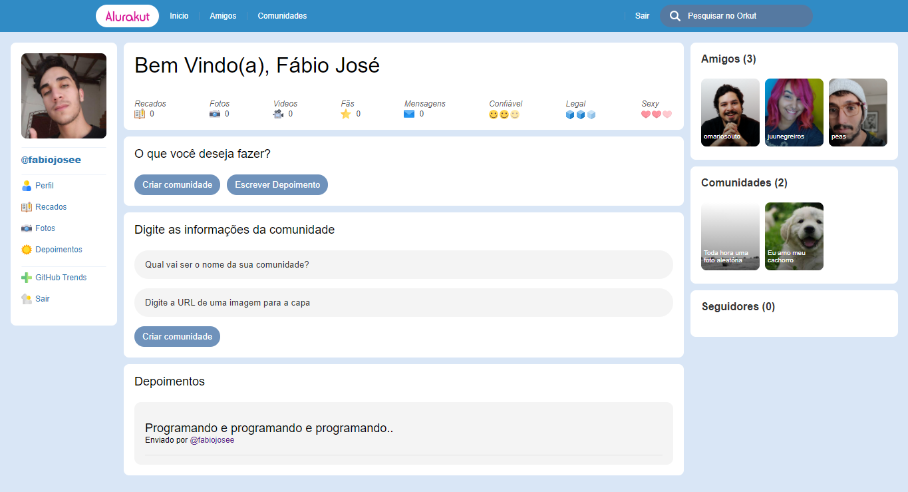

# Alurakut

Projeto desenvolvido através do curso gratuito "Imersão React" ofertado pela plataforma Alura cursos. O curso foi destinado à aprendizagem da framework Next.js, utilizando React JS, styled components, DatoCMS e Vercel.

Link para visualização do projeto em produção: <a href="https://alurakut-dun-one.vercel.app/login" target="_blank">https://alurakut-dun-one.vercel.app/login</a>
